# 👋 Hey there! I'm Ritesh Malviya

<div align="center">
  
</div>

<p align="center">
  <a href="mailto:riteshsmalviya03@gmail.com">📧 Email</a> •
  <a href="https://linkedin.com/in/ritesh-malviya-2a4a63227/">💼 LinkedIn</a> •
  <a href="https://github.com/riteshsmalviya">🐙 GitHub</a>
</p>

---

## 🚀 About Me

> *"Code is like humor. When you have to explain it, it's bad."* – Cory House

I'm a passionate **Software Engineer** at **Planful Softwares**, where I craft scalable backend solutions and refactor legacy systems. Completed my B.Tech in Computer Science with a stellar **8.87 CGPA**, I love turning complex problems into elegant code.

- 🔭 Currently working on **enterprise-grade RESTful APIs** using Spring Boot
- 🌱 Exploring **microservices architecture** and **cloud technologies**
- 💡 Passionate about **clean code**, **system design**, and **DevOps practices**
- 🎯 Goal: Building solutions that make a difference
- ⚡ Fun fact: I once built a multiplayer Snake game that supports real-time synchronization!

---

## 🛠️ Tech Arsenal

<div align="center">

### Languages


### Frameworks & Technologies


### Tools & Platforms


</div>

---

## 💼 Professional Journey

### 🏢 **Software Engineer** @ Planful Softwares
*January 2025 - Present | Hyderabad*

- 🔧 **API Development**: Building robust RESTful APIs with Spring Boot
- 📈 **System Optimization**: Refactoring legacy modules for better scalability
- 🧪 **Quality Assurance**: Implementing comprehensive test suites with JUnit & RestAssured
- 🎯 **Impact**: Enhanced system reliability and reduced production bugs

### 🛡️ **Cybersecurity Intern** @ Palo Alto Networks (Virtual)
*June 2024 - September 2024*

- 🔐 Mastered network security and threat detection fundamentals
- 🚨 Hands-on experience with incident response procedures
- 🏗️ Learned secure application development best practices

---

## 🚀 Featured Projects

<div align="center">

### 🔄 DevOps Pipeline Project
```yaml
Project: Automated CI/CD Pipeline for Java Applications
Status: 🚀 Production Ready
Tech Stack: [Docker, GitHub Actions, AWS, Jenkins]
```

<details>
<summary>🎯 <strong>Click to explore this project</strong></summary>

<br>


**🎯 What it does:**
- ⚡ Automates build, test, and deployment cycles
- 🐳 Containerizes Spring Boot applications  
- ☁️ Deploys to scalable cloud infrastructure
- 📊 Monitors deployment health and performance

**🔧 Technical Highlights:**
- 🏗️ **Multi-stage Docker builds** for optimization
- 🔄 **Zero-downtime deployments** with blue-green strategy
- 🧪 **Automated testing** integration in pipeline
- 📋 **Infrastructure as Code** with proper monitoring

</details>

---

### 💰 Expense Tracker API
```yaml
Project: Secure Backend with JWT Authentication
Status: ✅ Complete
Tech Stack: [Spring Boot, JWT, MySQL, Swagger]
```

<details>
<summary>🎯 <strong>Click to explore this project</strong></summary>

<br>


**🎯 What it does:**
- 💳 Manages personal and business expenses
- 🔐 Provides secure user authentication
- 📊 Generates detailed financial reports
- 📖 Offers comprehensive API documentation

**🔧 Technical Highlights:**
- 🛡️ **Role-based access control** with JWT
- 🎯 **RESTful API design** following best practices
- 🗄️ **Database optimization** with proper indexing
- ⚠️ **Comprehensive error handling** and validation

</details>

---

### 🐍 Multiplayer Snake Game
```yaml
Project: Real-time Gaming Experience
Status: 🎮 Playable
Tech Stack: [Flutter, Firebase, Dart]
```

<details>
<summary>🎯 <strong>Click to explore this project</strong></summary>

<br>


**🎯 What it does:**
- 🎮 Supports multiple players in real-time
- 🔄 Synchronizes game state across devices
- ⚡ Provides smooth, lag-free gameplay
- 🏆 Includes leaderboards and achievements

**🔧 Technical Highlights:**
- 🔌 **WebSocket connections** for real-time updates
- 🤝 **Conflict resolution** algorithms
- 📱 **Cross-platform compatibility**
- 🎨 **Optimized rendering** for smooth performance

</details>

---

### 🌟 Project Architecture Overview

```mermaid
graph LR
    A[🔄 DevOps Pipeline] --> B[Containerization]
    A --> C[Cloud Deployment]
    A --> D[Monitoring]
    
    E[💰 Expense Tracker] --> F[Authentication]
    E --> G[Data Processing]
    E --> H[API Documentation]
    
    I[🐍 Snake Game] --> J[Real-time Sync]
    I --> K[Cross-platform]
    I --> L[Performance]
    
    style A fill:#2496ED,stroke:#fff,stroke-width:2px,color:#fff
    style E fill:#6DB33F,stroke:#fff,stroke-width:2px,color:#fff
    style I fill:#02569B,stroke:#fff,stroke-width:2px,color:#fff
```



### 📊 Project Impact Dashboard

<div align="center">

| 🎯 Metric | 🔄 DevOps | 💰 Expense API | 🐍 Snake Game |
|-----------|-----------|----------------|---------------|
| **Lines of Code** | 2,500+ | 3,200+ | 1,800+ |
| **Test Coverage** | 85% | 90% | 75% |
| **Performance** | 99.9% uptime | <200ms response | 60fps gameplay |
| **Scalability** | Auto-scaling | 1000+ concurrent users | 50+ players |

</div>

</div>

### 🌟 Project Showcase Stats

<div align="center">

| Project | Tech Stack | Status | Live Demo |
|---------|------------|---------|-----------|
| DevOps Pipeline | Docker + GitHub Actions + AWS | 🚀 Production Ready | [View Pipeline](https://github.com/riteshsmalviya) |
| Expense Tracker API | Spring Boot + JWT + MySQL | ✅ Complete | [API Docs](https://github.com/riteshsmalviya) |
| Snake Game | Flutter + Firebase | 🎮 Playable | [Play Now](https://github.com/riteshsmalviya) |

</div>

---

## 📊 GitHub Analytics

<div align="center">
  
  
</div>

<div align="center">
  
</div>

---

## 🏆 Achievements & Recognition

<div align="center">

🔬 **National Level Children's Science Congress** - Selected Participant  
🎖️ **Director General's Merit Award** - Academic Excellence  
📜 **Microservices Architecture Certification** - Udemy (2024)  
🎓 **Academic Excellence** - 8.87 CGPA & 95.6% in 12th Grade  

</div>

---

## 📈 What I'm Learning

- 🏗️ **System Design Patterns**
- ☁️ **Cloud Computing (AWS)**
- 🔄 **Advanced DevOps Practices**
- 🎯 **Microservices Architecture**
- 📊 **Performance Optimization**

---

## 🤝 Let's Connect!

<div align="center">
  
I'm always excited to collaborate on interesting projects and connect with fellow developers!

[](mailto:riteshsmalviya03@gmail.com)
[](https://linkedin.com/in/ritesh-malviya-2a4a63227/)
[](https://github.com/riteshsmalviya)

</div>

---

<div align="center">
  
</div>

<div align="center">
  
### 💫 *"The best way to predict the future is to create it."* 💫

</div>

---

<div align="center">
  
</div>
